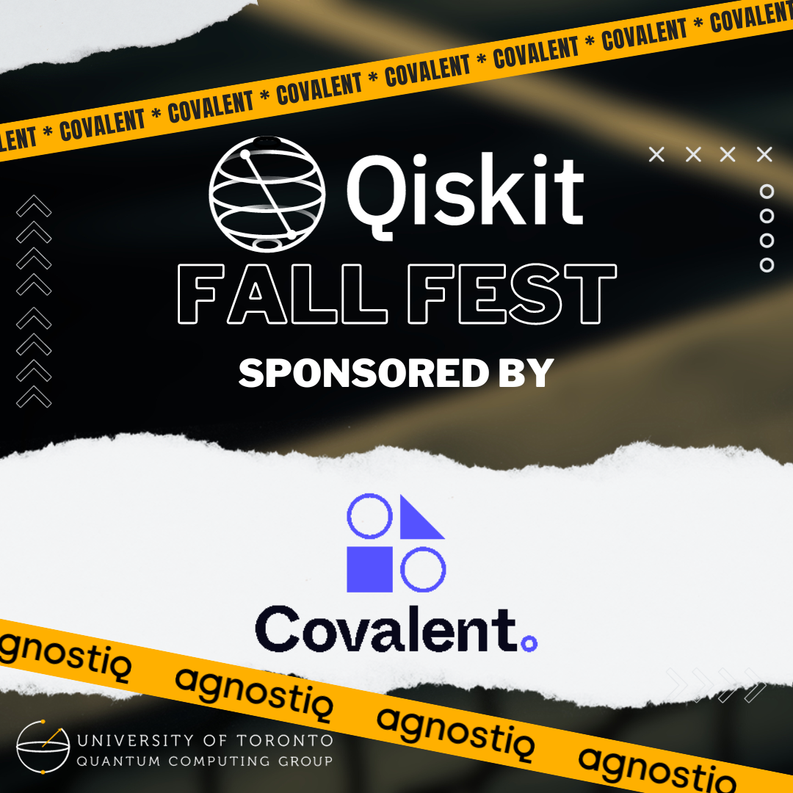
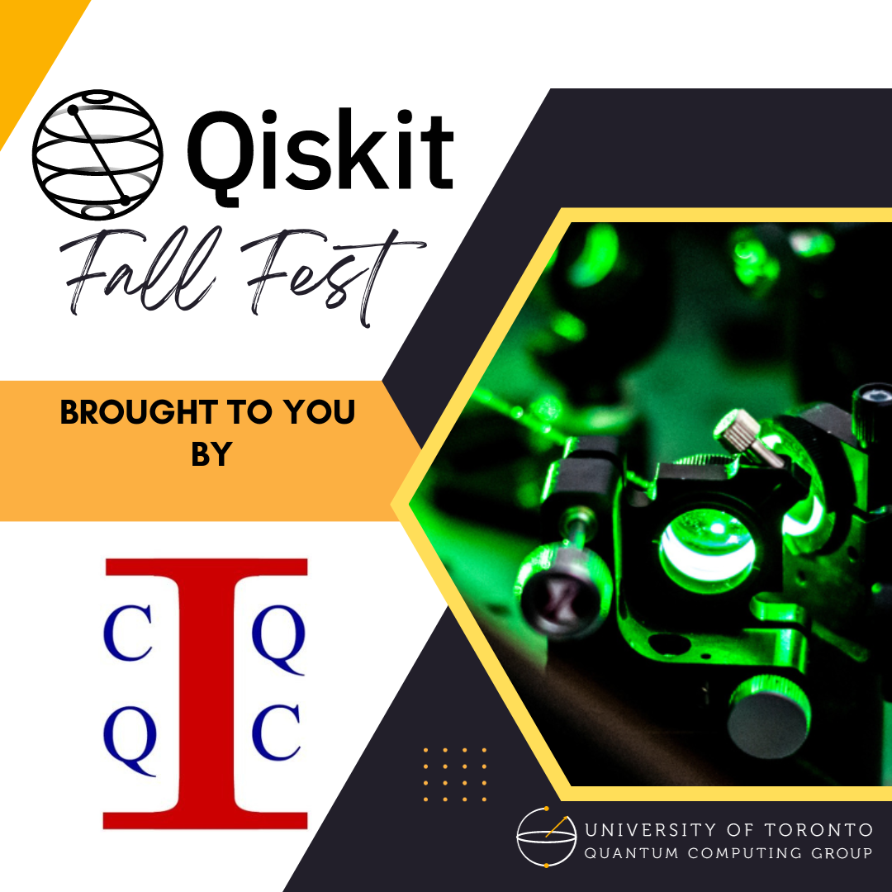

# UTQC Qiskit Fall Fest 2023

||

Welcome to the University of Toronto's Quantum Qiskit Fall Fest! Join us for an exciting day filled with informative talks, engaging workshops, thrilling challenges, and free snacks, all centered around the fascinating world of Quantum Computing and IBM's open-source development tool, Qiskit. Whether you're a seasoned quantum enthusiast or just curious about this emerging field, there's something for everyone at this event.

## Event Details

- **Date:** Thursday, November 9th (Reading Week)
- **Location:** Bahen centre of I.T.
- **Mode:** Hybrid (Both Online and In-Person)
- **Registration:** https://forms.gle/51drYAdc6gTrjXENA
- **Volunteering:** https://forms.gle/DwzYuuBAt21ZMXKx8
- **Discord:**[ https://discord.gg/yk9n6cbm](https://discord.gg/uVGnXZNA)

## Schedule

### 11:00 AM - 11:30 AM: Opening Ceremony
- Join us as we kick off this exciting event with an opening ceremony that sets the stage for a day of quantum exploration.

### 11:30 AM - 12:00 PM: Introduction to Quantum Mini-Talk
- Get started with a brief yet informative introduction to the world of quantum computing.

### 12:00 PM - 1:00 PM: Quantum Talk #1
- Dive deeper into the world of quantum computing with our first captivating talk of the day.

### 1:10 PM - 2:00 PM: Break (Free Lunch)
- Breaktime!

### 2:10 PM - 3:00 PM: Quantum Talk #2
- Continue your quantum journey with our second insightful talk.

### 3:10 PM - 5:00 PM: Introduction to Qiskit Workshop
- Learn how to harness the power of IBM's Qiskit through our hands-on workshop.

### 5:10 PM - 8:00 PM: Mini-Challenges
- Put your quantum knowledge and skills to the test with a series of mini-challenges designed to challenge and entertain.

## Join Us!

Whether you're attending in person at the Bahen Centre or joining us online, the UTQC Qiskit Fall Fest promises to be an event you won't want to miss. Get ready to explore the quantum world, expand your horizons in the field of quantum computing, and enjoy complimentary snacks throughout the day.

For more information and updates, stay tuned to our official event channels. We will be positing a discord link soon. We look forward to seeing you there!

